# Procesverslag
Markdown is een simpele manier om HTML te schrijven.  
Markdown cheat cheet: [Hulp bij het schrijven van Markdown](https://github.com/adam-p/markdown-here/wiki/Markdown-Cheatsheet).

Nb. De standaardstructuur en de spartaanse opmaak van de README.md zijn helemaal prima. Het gaat om de inhoud van je procesverslag. Besteedt de tijd voor pracht en praal aan je website.

Nb. Door *open* toe te voegen aan een *details* element kun je deze standaard open zetten. Fijn om dat steeds voor de relevante stuk(ken) te doen.

## Jij

  
uitwerken voor kick-off werkgroep

  ### Auteur:
  Alyaman Alhijazi

  #### Je startniveau:
  rood: ik vind het leuk om te coderen en ik begrijp het wel, maar ik heb weinig tijd om te oefenen en zijprojecten te maken

  #### Je focus:
  Ik ga focussen op toegankelijkheid zzodat mijn website responsive en gebruiksvriendelijk is op multiple devices schermgrootte
 

## Je website

  
uitwerken voor kick-off werkgroep

  ### Je opdracht:
 ik ga de website koenigsegg namaken (https://www.koenigsegg.com/home)

  #### Screenshot(s) van de eerste pagina (small screen): 
  Home pagina 

  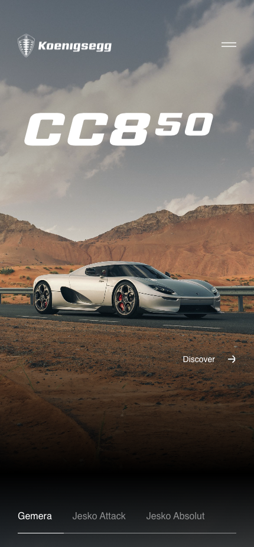
  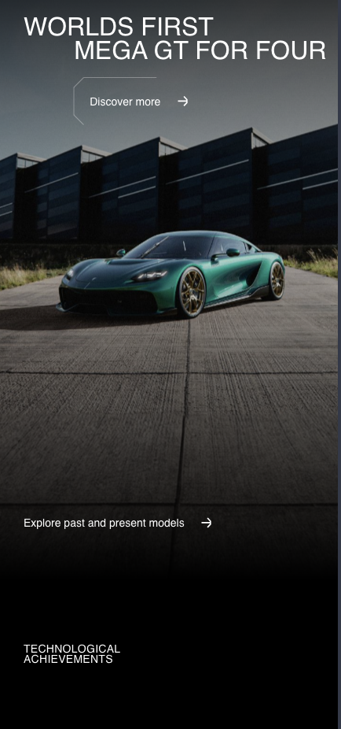
  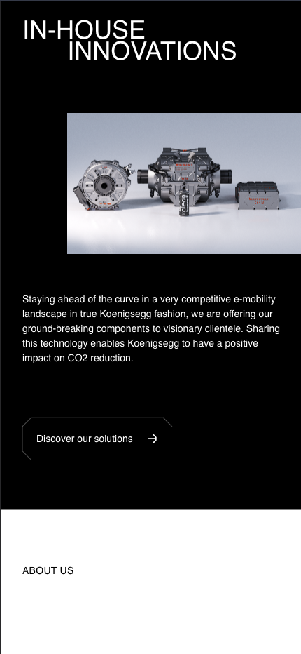
  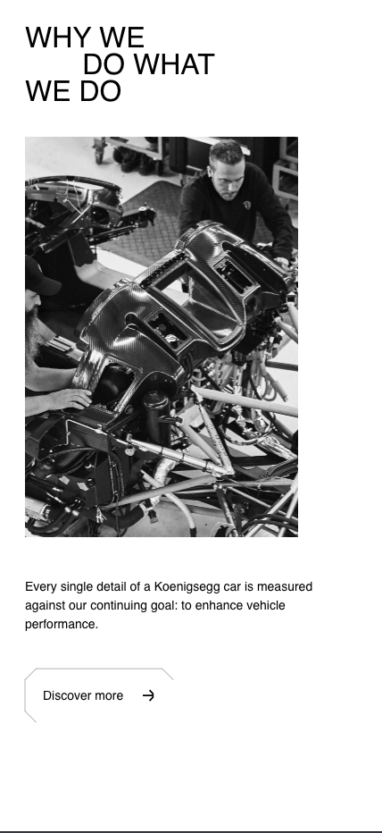
  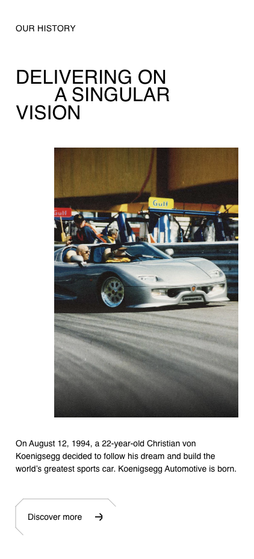
  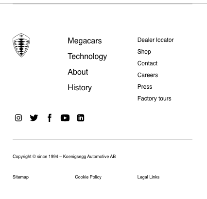

  #### Screenshot(s) van de tweede pagina (small screen):
  About us pagina

  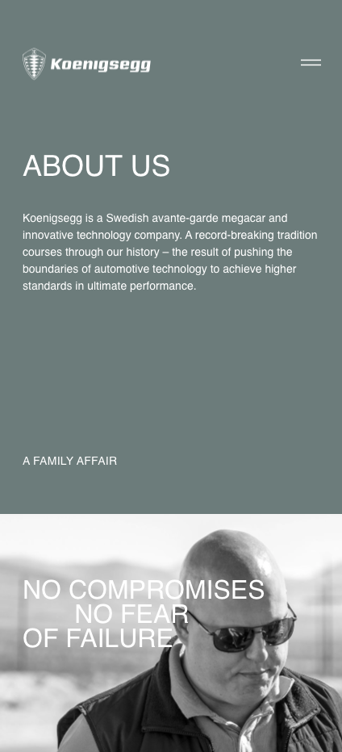
  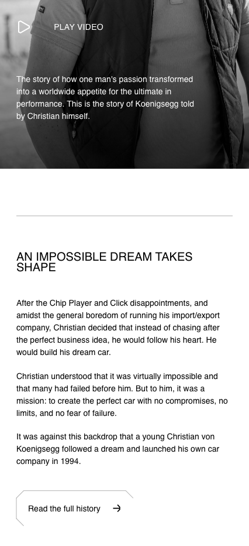
  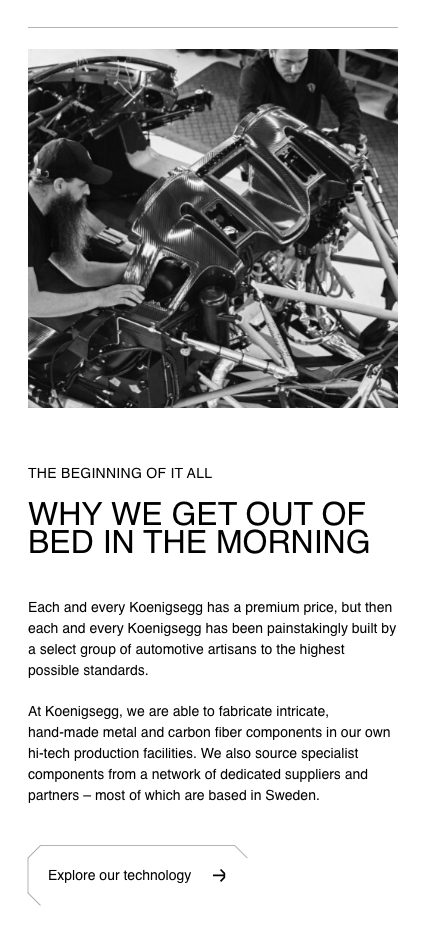
  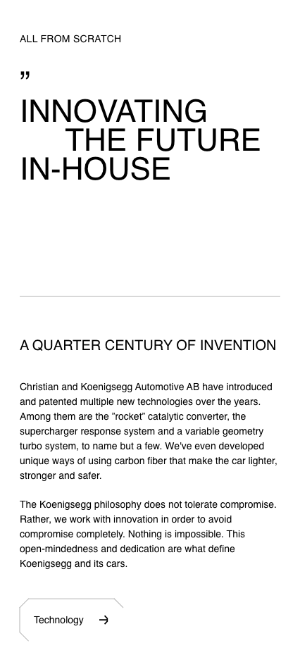
  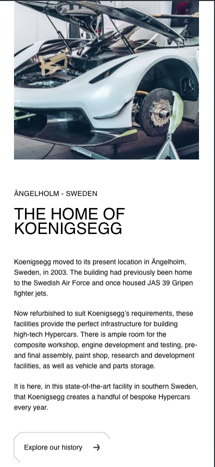
  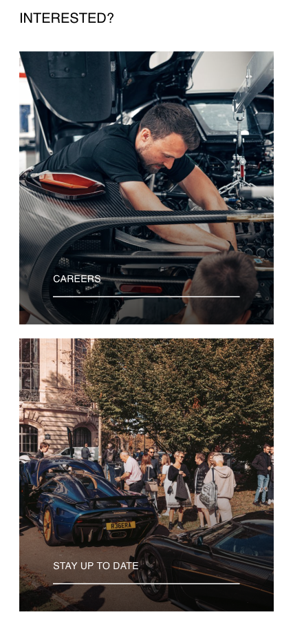
  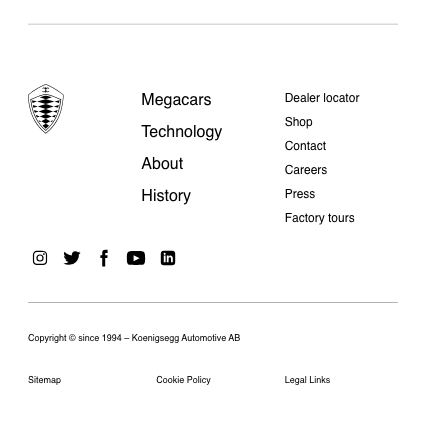
 

## Toegankelijkheidstest 1/2 (week 1)

  
uitwerken na test in 2e werkgroep

  ### Bevindingen
  Lijst met je bevindingen die in de test naar voren kwamen:
  #### content:
  * soms worden er uidrukkingen en moeilijk worden gebruikt zoals " delivering on a singular vision".
  * Buttons, a en label elementen hebben geen unike uitleg, de meeste zijn "discover more".
  * zij gebruiken left aligned tekst voor LTR language (english).
  #### global code:
  * er wordt een "lang" atribute gebruikt.
  * iedere pagina heeft een unieke title.
  * viewpoort is aan en tekst kan tot 5x vergroot worden.
  * landmarks zoals nav worden gebruikt maar zijn binnen div"s en kunnen niet geselecteerd worden met een screenreader.
  #### keyboard
  * focus is zichtbaar en je kunt makkelijk zien waar je bent op een pagina met een screenreader.
  * focus is niet zichtbaar op niet focus elementen zoals de dropdown menu.
  #### images
  * images hebben een alt tekst maar gebruikt geen menselijk taal.
  #### headings
  * er worden headings gebruikt met nette structuur.
  * er wordt maar een h1 gebruikt op iedere pagina.
  #### lists
  * er worden list gebruikt waar nodig is.
  #### controils
  * er worden geen a attributes gebruikt voor links.
  * links zijn niet herkenbaar als links maar als buttons.
  * vaak spans en divs en daarin worden de links gegooid.
  * er worden button elementen gebruikt voor buttons.
  er worden links gebruikt dat in een nieuwe window geopened worden maar zonder dat dat gecomuniceerd wordt.
  #### wat goed gaat:
  * zij gebruiken left aligned tekst voor LTR language (english).
  * er wordt een "lang" atribute gebruikt.
  * iedere pagina heeft een unieke title.
  * viewpoort is aan en tekst kan tot 5x vergroot worden.
  * focus is zichtbaar en je kunt makkelijk zien waar je bent op een pagina met een screenreader.
  * focus is niet zichtbaar op niet focus elementen zoals de dropdown menu.
  * images hebben een alt tekst maar gebruikt geen menselijk taal.
  * er worden headings gebruikt met nette structuur.
  * er wordt maar een h1 gebruikt op iedere pagina.
  * er worden list gebruikt waar nodig is.
  * er worden button elementen gebruikt voor buttons.

  #### wat niet toegankelijk is
  * soms worden er uidrukkingen en moeilijk worden gebruikt zoals " delivering on a singular vision".
  * Buttons, a en label elementen hebben geen unike uitleg, de meeste zijn "discover more".
  * De burger menu is onbereikbaar met een screenreader.
  * Body navigatie is onbereikbaar .
  * De meeste shortcuts zoals next link, next list en next paragraph werken niet (items niet te vinden).
  * landmarks zoals nav worden gebruikt maar zijn binnen div"s en kunnen niet geselecteerd worden met een screenreader.
  * de basics zijn er niet eigenlijk .
  * images hebben een alt tekst maar gebruikt geen menselijk taal.
  * er worden geen a attributes gebruikt voor links.
  * links zijn niet herkenbaar als links maar als buttons.
  * vaak spans en divs en daarin worden de links gegooid.
  * er worden button elementen gebruikt voor buttons.
  er worden links gebruikt dat in een nieuwe window geopened worden maar zonder dat dat gecomuniceerd wordt.

  ## contrast:
  * de contrast ratio tussen tekst en achtergrond is 21, omdat het een zwarte tekst is op een witte achtergrond.

## Breakdownschets (week 1)

  
uitwerken na afloop 3e werkgroep

  ### de hele pagina: 
  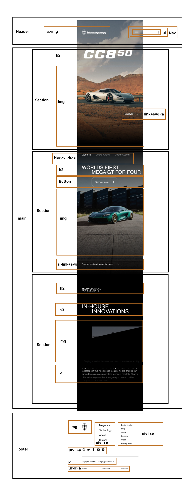

  ### dynamisch deel (bijv menu): 
  

  ### wellicht nog een dynamisch deel (bijv filter): 
  

## Voortgang 1 (week 2)

  
uitwerken voor 1e voortgang

  ### Stand van zaken
  hier dit ging goed & dit was lastig (neem ook screenshots op van delen van je website en code)

  ### Agenda voor meeting
  samen met je groepje opstellen

  | Alyaman      | student 2          | student 3    | student 4        |
  | ---            | ---                | ---          | ---              |
  | SVG in logo | en dit             | en ik dit    | en dan ik dat    |
  | Buttons achtergrond images | dit als er tijd is | nog een punt | dit wil ik zeker |
  |menu knop illustraties   | ...                | ...          | ...              |
  |pijltjes in de buttons|

  ### Verslag van meeting
  hier na afloop snel de uitkomsten van de meeting vastleggen

  - Een button gebruiken voor de burger menu
  - Geen externe link gebruiken voor de svg's (ook in het logo niet)
  - Focus eeerst op de html, css, js en op het eind de animaties van de buttons
  - gebruik svg's voor de de pijltjes
  - maak gebruik van borders voor het animeren van de buttons
  - een uitgebreide toegankelijkheid test (loop de checklist na)
  - image compress voor duurzaamheid 

## Voortgang 2 (week 3)

  
uitwerken voor 2e voortgang

  ### Stand van zaken
  hier dit ging goed & dit was lastig (neem ook screenshots op van delen van je website en code)

  ### Agenda voor meeting
  samen met je groepje opstellen

  |Alyaman      | student 2          | student 3    | student 4        |
  | ---            | ---                | ---          | ---              |
  | Video tag youtube embeded | en dit             | en ik dit    | en dan ik dat    |
  | wat is tabindex en autofocus?| dit als er tijd is | nog een punt | dit wil ik zeker |
  | time out?    | ...                | ...          | ...              |

  ### Verslag van meeting
  hier na afloop snel de uitkomsten van de meeting vastleggen

  - punt 1
  - punt 2
  - nog een punt
- ...

## Toegankelijkheidstest 2/2 (week 4)

  
uitwerken na test in 9e werkgroep

  ### Bevindingen
  Lijst met je bevindingen die in de test naar voren kwamen (geef ook aan wat er verbeterd is):

## Voortgang 3 (week 4)

  
uitwerken voor 3e voortgang

  ### Stand van zaken
  hier dit ging goed & dit was lastig (neem ook screenshots op van delen van je website en code)

  ### Agenda voor meeting
  samen met je groepje opstellen

  | student 1      | student 2          | student 3    | student 4        |
  | ---            | ---                | ---          | ---              |
  | dit bespreken  | en dit             | en ik dit    | en dan ik dat    |
  | en dat ook nog | dit als er tijd is | nog een punt | dit wil ik zeker |
  | ...            | ...                | ...          | ...              |

  ### Verslag van meeting
  hier na afloop snel de uitkomsten van de meeting vastleggen

  - punt 1
  - punt 2
  - nog een punt
  - ...

## Eindgesprek (week 5)

  
uitwerken voor eindgesprek

  ### Je uitkomst - karakteristiek screenshots:
  

  ### Dit ging goed/Heb ik geleerd: 
  Korte omschrijving met plaatjes

  

  ### Dit was lastig/Is niet gelukt:
  Korte omschrijving met plaatjes

  

## Bronnenlijst

  
continu bijhouden terwijl je werkt

  Nb. Wees specifiek ('css-tricks' als bron is bijv. niet specifiek genoeg). 
  Nb. ChatGpT en andere AI horen er ook bij.
  Nb. Vermeld de bronnen ook in je code.

  1. bron 1
  2. bron 2
  3. ...

